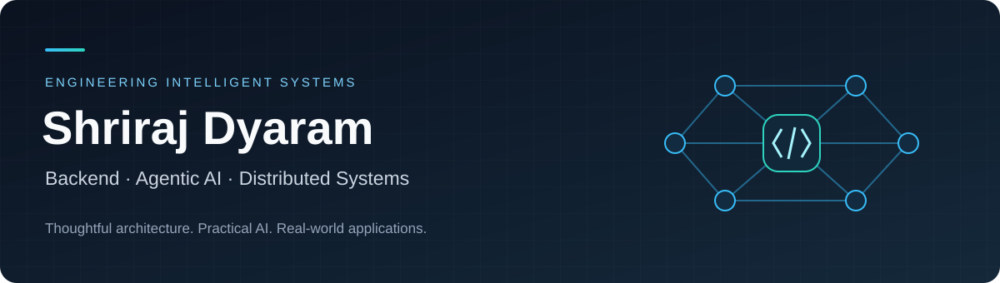

<!-- Profile: shriza1991 | Project descriptions distinguish personal repositories and team contributions. -->

  

  <strong>Third-year Information Technology undergraduate</strong> 
  Building backend services, agentic AI workflows, and event-driven systems.

  
  
  

## Engineering focus

I’m Shriraj. My main work areas are **backend engineering, agentic AI, and distributed systems**. I enjoy connecting practical AI capabilities with APIs, data pipelines, and clear system boundaries.

- **Backend engineering** — APIs, data models, service integration, and application workflows.
- **Agentic AI** — specialized agents, retrieval, speech pipelines, and grounded outputs.
- **Distributed systems** — asynchronous messaging, independent services, and event-driven orchestration.

## Selected projects

<table>
<tr>
<td width="50%" valign="top">

01 / Own repository

<h3><a href="https://github.com/shriza1991/DeployGuard">DeployGuard</a></h3>

<strong>AI deployment-risk intelligence</strong>

Event-driven platform that routes GitHub events through specialized risk agents, retrieves historical incident context, and produces explainable release decisions.

FastAPI · Kafka · Redis · Qdrant · Gemini · Docker

<a href="https://github.com/shriza1991/DeployGuard">Explore repository ↗</a> &nbsp;·&nbsp; <a href="https://drive.google.com/file/d/1FBGH5HkoxfywmfYxAOkdbDrylNfs-sZO/view">Demo video</a>

</td>
<td width="50%" valign="top">

02 / Team project · Backend contribution

<h3><a href="https://github.com/acchasujal/Setu">Setu</a></h3>

<strong>Voice-first education assistant</strong>

Makes school notices and documents accessible through multilingual voice interaction. Contributed backend work and a frontend hydration fix.

FastAPI · Next.js · Gemini · Groq Whisper · Edge TTS

<a href="https://github.com/acchasujal/Setu">Explore repository ↗</a> &nbsp;·&nbsp; <a href="https://setu-pwa.vercel.app/">Web app</a>

</td>
</tr>
<tr>
<td width="50%" valign="top">

03 / Team project · Graph intelligence

<h3><a href="https://github.com/acchasujal/CaseClock">CaseClock</a></h3>

<strong>Investigation decision intelligence</strong>

Combines investigation tracking with graph intelligence. Contributed graph APIs and backend graph-engine implementation through merged pull requests.

Python · FastAPI · Graph algorithms

<a href="https://github.com/acchasujal/CaseClock">Explore repository ↗</a> &nbsp;·&nbsp; <a href="https://github.com/acchasujal/CaseClock/pull/3">Merged contribution</a>

</td>
<td width="50%" valign="top">

04 / Team project · Full-stack contribution

<h3><a href="https://github.com/Vikramsindra/GreenPoint_Mumbai">GreenPoint</a></h3>

<strong>Waste-management operations</strong>

Mobile and web workflows for collection tracking and municipal operations. Contributed collection workflows, dashboard changes, and supporting backend work.

Express · MongoDB · React · React Native · Expo

<a href="https://github.com/Vikramsindra/GreenPoint_Mumbai">Explore repository ↗</a> &nbsp;·&nbsp; <a href="https://github.com/Vikramsindra/GreenPoint_Mumbai/pull/1">Merged contribution</a>

</td>
</tr>
<tr>
<td width="50%" valign="top">

05 / Own repository

<h3><a href="https://github.com/shriza1991/Dubify">Dubify</a></h3>

<strong>AI video-dubbing pipeline</strong>

Turns source video into English-dubbed output through transcription, script adaptation, speech synthesis, and timing alignment, with caching and resumable stages.

Python · Faster-Whisper · Gemini · Edge TTS · FFmpeg

<a href="https://github.com/shriza1991/Dubify">Explore repository ↗</a>

</td>
<td width="50%" valign="top">

06 / Team project · AI/backend contribution

<h3><a href="https://github.com/Whitehat-1711/scrapbookai">ScrapBook AI</a></h3>

<strong>Multi-agent content workflows</strong>

Team project whose repository documents the Blogy SEO engine: keyword research, competitor analysis, content generation, and SEO scoring. Contributed SEO-score improvements and title options.

FastAPI · Groq · MongoDB · React · Vite

<a href="https://github.com/Whitehat-1711/scrapbookai">Explore repository ↗</a> &nbsp;·&nbsp; <a href="https://github.com/Whitehat-1711/scrapbookai/commits?author=shriza1991">My commits</a>

</td>
</tr>
</table>

## Technology toolkit

<table>
<tr><td><strong>Languages</strong></td><td>    </td></tr>
<tr><td><strong>Backend &amp; data</strong></td><td>     </td></tr>
<tr><td><strong>Distributed systems</strong></td><td>  </td></tr>
<tr><td><strong>AI &amp; retrieval</strong></td><td>     </td></tr>
<tr><td><strong>Speech &amp; media</strong></td><td>  </td></tr>
<tr><td><strong>Product interfaces</strong></td><td>    </td></tr>
</table>

## Contributions

Beyond my own repositories, I contribute to team projects and open-source applications.

- **[CaseClock — graph engine](https://github.com/acchasujal/CaseClock/pull/3):** merged backend and graph-intelligence contribution.
- **[GreenPoint — collection workflows](https://github.com/Vikramsindra/GreenPoint_Mumbai/pull/1):** merged mobile, dashboard, and backend contribution.
- **[AI Resume Analyzer — loading experience](https://github.com/Muskankr/AI-Resume-Analyzer/pull/113):** merged React/TypeScript skeleton components with shimmer animation and accessibility handling.

## GitHub activity

  
  

Public GitHub activity · Language distribution reflects repository code, not proficiency.

---

  <strong>Let’s build useful systems.</strong> 
  Interested in backend engineering, agentic AI, distributed systems, and collaborative projects.  
  <a href="https://www.linkedin.com/in/shriraj-dyaram-1a8698378/">LinkedIn</a> &nbsp;·&nbsp;
  <a href="mailto:sdyaram878p@gmail.com">sdyaram878p@gmail.com</a>

